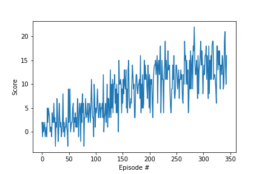

## Navigation Project Report
##Learning Algorithm

In this project, the agent's goal is to collect as much yellow bananas as possible in a given episode with limited time.
The agent has full access to the state (37 variables) of the environment, and 4 movements as its actions.
Through interacting with the environment, the agent receives positive (when collecting yellow banana) 
and negative rewards (when collecting purple banana). Since the state space is continuous, we use a neural network as
a function approximator Q to represent the Q-table, where input is the observed state, output are the 4 action values.
```python
Q(state) = action_values
```
To train the network, the goal is to minimize the mean squared error of "temperal difference error".

The TD-error, depends on the current reward, target Q value of the next state given greedy policy and the current estimated local Q value given the current action.
The local Q value is the network we are going to train, and the target Q value will be updated slowly toward the local one.

A replay buffer is used to perform experience reply, in order to remove data correlation and reuse experiences.

Other enhancement technique Used:
- Double DQN
- Duelling Network
- Priority Replay Buffer (Not activated)

During the project, the Duelling Network gives the best performance boost, while
the Double DQN gives little or no improvement. The priority replay buffer uses quite some additional computation power, and 
in this experiment doesn't bring performance gain.

Another observation is the performance doesn't increase when scaling up the network size more.

Tuning EPS_START from 1.0 to 0.6, and EPS_DECAY from 0.995 to 0.99 saves around 100 episode.

Hyperparameters:

```python
BUFFER_SIZE = int(1e5)  # replay buffer size
BATCH_SIZE = 64  # minibatch size
GAMMA = 0.99  # discount factor
TAU = 1e-3  # for soft update of target parameters
LR = 5e-4  # learning rate
UPDATE_EVERY = 4  # how often to update the network

EPS_START = 0.7
EPS_END = 0.01
EPS_DECAY = 0.99
```
#### Network Architecture using Duelling Network
The network architecture is simple, with one hidden fully connected layer of 128 neurons, and
two branches after it. One fully connected layer to calculate the 1 state value, and another 
fully connected layer to calculate the 4 action value offsets.

The result of the two heads are summed up by the following equation to form the final action values.
```python
(action_value_offsets - mean(action_value_offsets)) + state_value
```


### Plot of Rewards
The training will terminate once average score reaches 13.

The network converges in 244 episodes

The score per episode during training:




### Demo
Runing the trained model with exploration epsilon = 0.01


### Ideas for Future Work
- We can see in the 3rd episode from the demo, the agent stuck in one situation
and is not able to jump out. It is worth investigating why and how to solve this problem.

- The priority reply buffer implemented currently is not very efficient. It would be interesting to try 
the "sum-tree" data structure mentioned in the paper.

- In the end, the priority reply buffer doesn't improve the average score in the experiment, it can be it is not implemented
correctly, or the set of hyperparameters should be further tuned.

